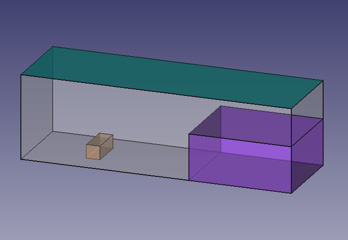
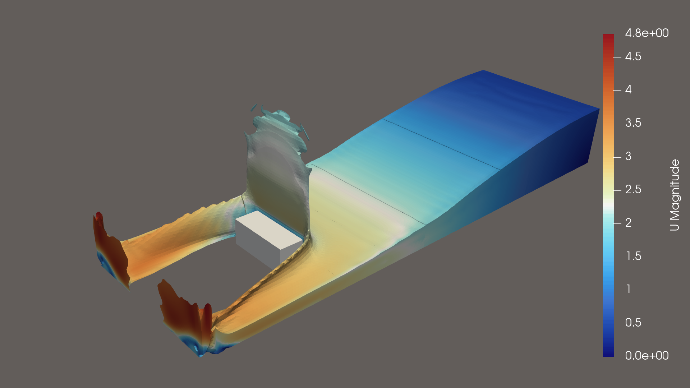

# 3D dam-break with obstacle

This test case was taken from the following paper, which includes a comparison with experimental data:
- K.M.T. Kleefsman, G. Fekken, A.E.P. Veldman, B. Iwanowski, and B. Buchner. A volume-of-fluid simulation method for
wave impact problems. _Journal of Computational Physics_ (2005) **206** p.p. 363-393

