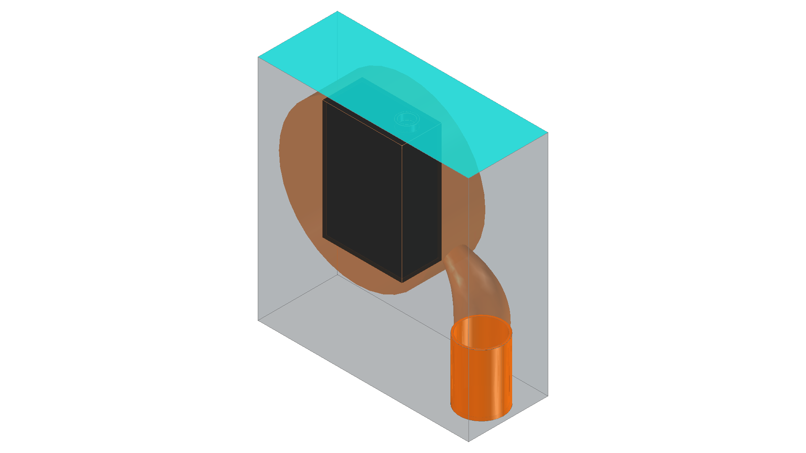
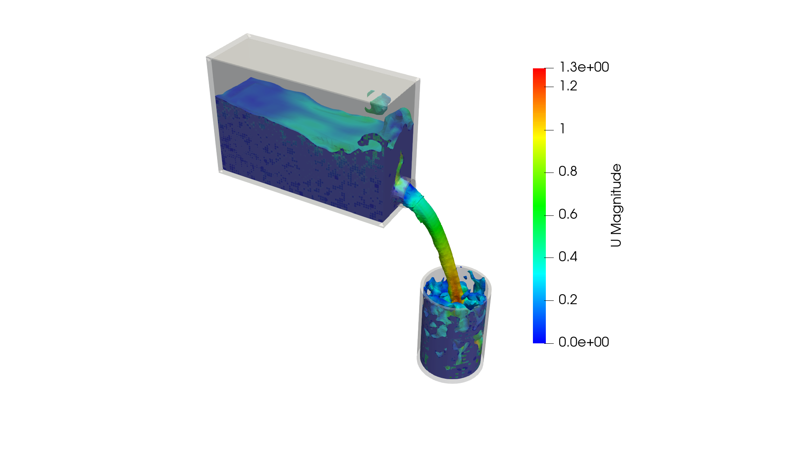

# water pouring on a cup

this is an example about setting variable speed for the MMR region to make the bottle rotate 90 degrees
then stop for 1.5 seconds then rotate back to the original position

