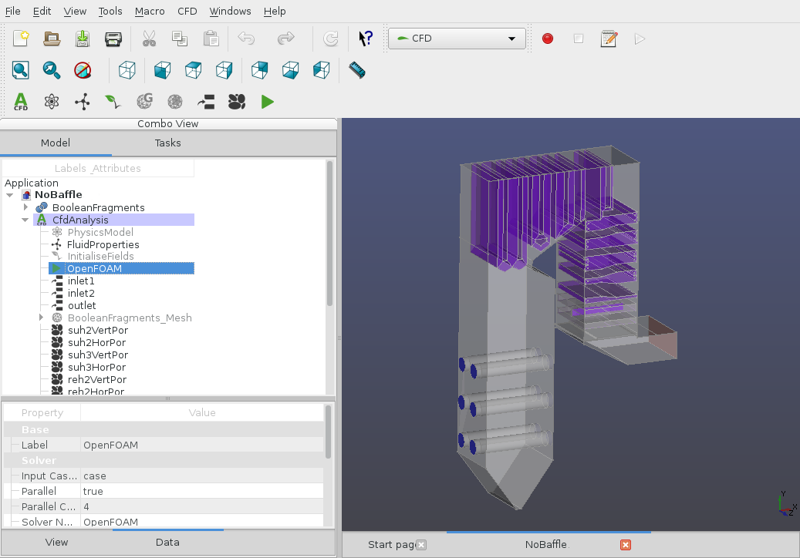

# CfdOF: A Computational fluid dynamics (CFD) workbench for FreeCAD

This workbench aims to help users set up and run CFD analyses within the [FreeCAD](https://freecad.org)
modeller, and serves as a front-end (GUI) for the popular OpenFOAM® CFD toolkit (www.openfoam.org, www.openfoam.com).
It guides the user in selecting the relevant physics, specifying the material properties, generating a mesh, assigning
boundary conditions and choosing the solver settings before running the simulation. Best practices are specified to
maximise the stability of the solvers.

Disclaimer:
This offering is not approved or endorsed by OpenCFD Limited, producer and distributor of the OpenFOAM software via
www.openfoam.com, and owner of the OPENFOAM® and OpenCFD® trade marks

## Features

### Current:

#### Flow physics
* Incompressible, laminar flow (simpleFoam, pimpleFoam)
* Support for various RANS, LES and DES turbulent flow models
* Incompressible free-surface flow (interFoam, multiphaseInterFoam)
* Compressible buoyant flow (buoyantSimpleFoam, buoyantPimpleFoam)
* High-speed compressible flow ([HiSA](https://hisa.gitlab.io))
* Porous regions and porous baffles
* Basic material database
* Flow initialisation with a potential solver
* Solution of arbitrary passive scalar transport functions
#### Meshing
* Cut-cell Cartesian meshing with boundary layers (cfMesh)
* Cut-cell Cartesian meshing with baffles (snappyHexMesh)
* Tetrahedral meshing using Gmsh, including conversion to polyhedral dual mesh
* Post-meshing check mesh
* Support for dynamic mesh adaptation for supported solvers
#### Post-processing and monitoring
* Postprocessing using Paraview
* Basic support for force-based function objects (Forces, Force Coefficients)
* Basic support for probes
#### Other features
* Runs on Windows 7-11 and Linux
* Unit/regression testing
* Case builder using an extensible template structure
* Macro scripting
* Support for distributed parallel (cluster) runs via mpiexec & --hostfile

### Platforms supported

#### Linux

Any system on which FreeCAD and the prerequisites listed below can be installed.

#### Windows

Windows 7-11; 64-bit version is required.

#### macOS

Not widely tested, but success has been reported. See
[the following forum post](https://forum.freecad.org/viewtopic.php?f=37&t=63782&p=547611#p547578)
for instructions.

## Getting started

### Prerequisites

The CfdOF workbench depends on the following external software, some of
which can be automatically installed (see below for instructions).

- [Latest release version of FreeCAD (at least version 0.20.0 / git commit 29177)](https://www.freecad.org/downloads.php)
 or [latest development version (prerelease)](https://github.com/FreeCAD/FreeCAD-Bundle/releases/tag/weekly-builds)
- OpenFOAM [Foundation versions 9-11](http://openfoam.org/download/) or [ESI-OpenCFD versions 2006-2312](http://openfoam.com/download)
- [Paraview](http://www.paraview.org/)
- [cfMesh (customised version updated to compile with latest OpenFOAM versions)](https://sourceforge.net/projects/cfmesh-cfdof/)
- [HiSA (High Speed Aerodynamic Solver)](https://hisa.gitlab.io)
- [Gmsh (version 2.13 or later)](http://gmsh.info/) - optional, for generating tetrahedral meshes

### Setting up the CfdOF workbench

#### Windows

The latest
[release](https://www.freecad.org/downloads.php)
or [development](https://github.com/FreeCAD/FreeCAD-Bundle/releases/tag/weekly-builds)
FreeCAD build can be obtained (64 bit version) and installed
by respectively running the installer or extracting the .7z archive to a directory
\<FreeCAD-directory\>. In the latter case, FreeCAD can be run in place
(\<FreeCAD-directory\>\bin\FreeCAD.exe).

CfdOF itself is installed into FreeCAD using the Addon manager:

* Run FreeCAD
* Select Tools | Addon manager ...
* Select CfdOF in the list of workbenches, and click "Install/update"
* Restart FreeCAD
* For installation of dependencies, see below

Note: The CfdOF workbench can be updated at any time through the Addon manager.

##### Dependency installation

Dependencies can be checked and installed conveniently from the CfdOF Preferences panel in FreeCAD.
In the FreeCAD window, select CfdOF | Open preferences.  The dependencies can be installed as
individual components or as part of a docker container (refer to the **Docker container install** section below).

The OpenFOAM installation is via the
[OpenCFD MinGW package](https://www.openfoam.com/download/install-binary-windows-mingw.php), and
the [BlueCFD Core](https://bluecfd.github.io/Core/) port of OpenFOAM is also supported.

OpenFOAM can be installed manually using the above links, or by clicking the relevant
button in the Preferences panel described above. If you experience problems running OpenFOAM in CfdOF, please make
sure you have a working installation by following instructions on the relevant websites.

To interface correctly with the OpenFOAM installation, CfdOF needs to be able to write to its
install location.
Some users experience problems using a location inside C:\Program Files due to restrictions
imposed by Windows User Account Control. It is therefore suggested to install to an alternative
location, preferably in your home directory.

If OpenFOAM is installed with administrator privileges using the above packages, then Microsoft MPI
will also optionally be installed. If not, then it will be necessary to download and
install it manually from [here](https://learn.microsoft.com/en-us/message-passing-interface/microsoft-mpi#ms-mpi-downloads).
MPI is needed in order to run in parallel.

Set the OpenFOAM install directory in the preferences
panel to the install directory ending in the 'vXXXX' subfolder (where XXXX is the version number installed)
for the MinGW package, or the BlueCFD install directory.
 It will be automatically detected in the default install
locations.

Any version of [ParaView](https://www.paraview.org/download/) can be installed,
by following the above link or clicking the relevant button in the Preferences panel.
Set the ParaView install path in the preferences panel to the 'paraview.exe' file in the 'bin'
subfolder of the ParaView installation. Common defaults will be detected if it is left blank.

Likewise, cfMesh and HiSA can be installed from the Preferences panel. Do not close
it until the 'Install completed' message is received.
Note that the OpenFOAM installation must be in a writable location
for cfMesh and HiSA to be installed successfully.

Choosing the "Check dependencies" option will verify that all
prerequisites have been successfully installed.

#### Linux

AppImages of the latest [release](https://www.freecad.org/downloads.php)
or [development](https://github.com/FreeCAD/FreeCAD-Bundle/releases/tag/weekly-builds)
versions of FreeCAD can be downloaded and run directly
without installation. Note that you will
have to enable execution permission on the downloaded file to run it.
Otherwise, FreeCAD can be built
from the source code at https://github.com/FreeCAD/FreeCAD .

Note:
* Installations of FreeCAD via Linux package managers
make use of your local Python installation. Therefore you might need to install additional
Python packages to get full functionality. The dependency checker (see below) can help to diagnose
this.
* Note that the 'Snap' container installed through some distributions' package managers
can be problematic as it does not allow access to system
directories, and therefore OpenFOAM has to be installed in the user's home directory
to be runnable from FreeCAD.

For the reasons above we recommend the AppImage as the most robust installation
option on Linux.

CfdOF itself is installed into FreeCAD using the Addon manager:

* Run FreeCAD
* Select Tools | Addon manager ...
* Select CfdOF in the list of workbenches, and click "Install/update"
* Restart FreeCAD
* For installation of dependencies, see below

Note: The CfdOF workbench can be updated at any time through the Addon manager.

##### Dependency installation

Dependencies can be checked and some of them installed
conveniently from the CFD Preferences panel in FreeCAD.
In the FreeCAD window, select Edit | Preferences ... and
choose "CfdOF".

The dependencies can be installed manually, or as part of a docker container (refer to Docker container install below). Manual
installation may be undertaken for OpenFOAM ([OpenCFD](https://openfoam.com/download) or [Foundation](https://openfoam.org/download/)
versions), [Paraview](http://www.paraview.org/) and [Gmsh](http://gmsh.info/) (optional) by using the links above or your distribution's package
manager. Note, however, that the OpenFOAM packages bundled in
some Linux distributions may be out of date or incomplete; for example,
the standard Debian and Ubuntu packages do not include the build command 'wmake'
and therefore cannot be used with the optional components 'HiSA' and 'cfMesh'.
We therefore recommend installation of the packages supplied through
the official websites above. Please make sure the install the 'development'
package where available (usually named with the suffix '-devel' or '-dev') to 
be sure that the optional components 'HiSA' and 'cfMesh' can be compiled
with 'wmake'.

Set the OpenFOAM install directory in the preferences
panel - examples of typical install locations are /usr/lib/openfoam/openfoam2306,
/opt/openfoam10 or /home/user/OpenFOAM/OpenFOAM-10.x (it will be automatically
detected in common default install
locations). Note that if you have loaded the desired OpenFOAM
environment already before starting FreeCAD, the install directory should be left blank.

cfMesh and HiSA can be installed using the Preferences panel described above,
and can be downloaded and built from their source
code inside your OpenFOAM installation if you have
not already done so yourself. Note that this is a lengthy process.

Choosing the "Check dependencies" option will verify that all
prerequisites have been successfully installed.

#### Docker container install

Docker containers offer a convenient way of providing pre-compiled program packages for both windows and linux. macOS can also be supported but
assistance may be required to get this to work.  Please leave a message on the [forum](https://forum.freecad.org/viewforum.php?f=37).

##### Docker on Windows

[Podman](https://podman.io/) is the preferred docker run-time for Windows as using the WSL fast file system integration appears to offer performance benefits. [Docker Desktop](https://www.docker.com/products/docker-desktop/) may also be used.

1. To use podman:
    1. If an old version of podman is installed, remove it by opening a cmd window and typing the following commands:
        * `podman machine stop podman-machine-default`
        * `podman machine rm podman-machine-default`
        * Agree to the deletion of files.
    2. Install [podman](https://github.com/containers/podman/releases) .
    3. Open a `cmd` (or terminal) window and issue the following commands:
        * `podman machine init`
        * `podman machine start` Note, the set rootful command should not be used.
        * `wsl -d podman-machine-default`
        * `sudo usermod --add-subuids 10000-75535 $USER`
        * `sudo usermod --add-subgids 10000-75535 $USER`
        * `podman system migrate`
        * `mkdir -p /home/user/cfdof` This command makes a directory for WSL fast file system integration 
        * `exit`
        * `exit` (A second time to return to the cmd prompt).
    4. In the cfdof preference page, set the _Default output directory_ to use the WSL fast file system integration directory (created above):
        * `\\wsl$\podman-machine-default\home\user\cfdof`
2. To use Docker:
    * Install [docker desktop](https://www.docker.com/products/docker-desktop/))
3. Edit &rarr; Preferences &rarr; CfdOF: Press the _Install Paraview_ button.
4. Edit &rarr; Preferences &rarr; CfdOF: Select _Use docker_.
5. Press the _Install Docker Container_ button. There is no need to install gmsh, cfmesh and HISA as they are included in the docker image.
6. Press the _Run dependency checker_ button.

##### Docker on Linux

Either docker or podman may be used on linux; however, podman is preferred.

1. If podman is not installed by default, install docker or podman. Typical installation instructions are shown below for a debian based system. Similar instructions will be available for other distributions.
    1. Docker installation
        * `sudo apt install docker.io`
        * `sudo usermod -aG docker $USER`
        * Logout and log back into the session to update the user's groups (or, `sudo su $USER` can be used if Freecad is run from the current terminal window).
    2. Podman installation
        * `sudo apt install -y podman crun`
        * `sudo usermod --add-subuids 10000-75535 $USER`
        * `sudo usermod --add-subgids 10000-75535 $USER`
        * `podman system migrate`
3. Install paraview as per the package installation instructions for your distribution
   (for example `sudo apt-get install paraview` on debian).
4. Edit &rarr; Preferences &rarr; CfdOF: Select _Use docker_.
5. Press the _Install Docker Container_ button. There is no need to install gmsh, cfmesh and HISA as they are included in the docker image.
6. Press the _Run dependency checker_ button.

## Documentation

At present there is no formal documentation for CfdOF apart from this README.
However, demonstration cases
are provided inside the 'Demos' folder of the
[CfdOF workbench directory](https://github.com/jaheyns/cfdof). These aim
to provide a basic overview of features and best practices. The examples are run
by loading and executing the macro files ending in '.FCMacro' in the various sub-directories
in the 'Demos' directory. Where there are several numbered files, these should be run in order
and aim to demonstrate step-by-step how the case is set up.

Community assistance may be sought at the
[CfdOF dedicated FreeCAD forum](https://forum.freecad.org/viewforum.php?f=37),
and a list of various third-party documentation is available in
[the following forum post](https://forum.freecad.org/viewtopic.php?f=37&t=33492#p280359).

### FAQ

Q: Do I have to create a watertight geometry?

A: This isn't necessary if using the cartesian mesh generators _snappyHexMesh_ and _cfMesh_.
You can make use of shells and compounds instead of creating solids, as long as the
collection of shapes in the compound being meshed blocks off the volume desired.
Gaps smaller than the mesh spacing are also allowed.

## Feedback

### Reporting Bugs

Please discuss issues on the [CfdOF FreeCAD forum](https://forum.freecad.org/viewforum.php?f=37)
for community assistance.
Bugs can be reported on the [Github project site](https://github.com/jaheyns/cfdof).

Please first read the [guidelines for reporting bugs](https://forum.freecad.org/viewtopic.php?f=37&t=33492#p280359)
in order to provide sufficient information.

## Development

If you would like to get involved in the development of CfdOF, please refer to the [Contribution guidelines](CONTRIBUTING.md)
and [Roadmap](ROADMAP.md).

## Acknowledgements

### Funding

This development was made possible through initial funding from [Eskom Holdings SOC Ltd](http://www.eskom.co.za)
and the [Council for Scientific and Industrial Research](https://www.csir.co.za) (South Africa).

### Contributors

* Oliver Oxtoby (CSIR, 2016-2018; private 2019-) <oliveroxtoby@gmail.com>
* Johan Heyns (CSIR, 2016-2018) <jaheyns@gmail.com>
* Alfred Bogaers (CSIR, 2016-2018) <alfredbogaers@gmail.com>
* Jonathan Bergh (2022)
* Qingfeng Xia (2015)
* Thomas Schrader (2017-) <info@schraderundschrader.de>
* Michael Hindley (2016)
* Mark Mackenzie [Forum: @markrmau]
* Katy Akmal (2022) [Forum: @KAKM]
* Adrian Insaurralde (2022)
* Klaus Sembritzki (2017)

### Dedication

CfdOF is dedicated to the memory of Michael Hindley. It is thanks to his irrepressible enthusiasm for
FreeCAD and open source software that this workbench exists. Rest in peace.
